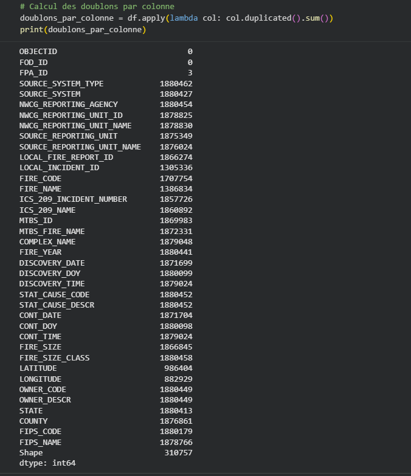
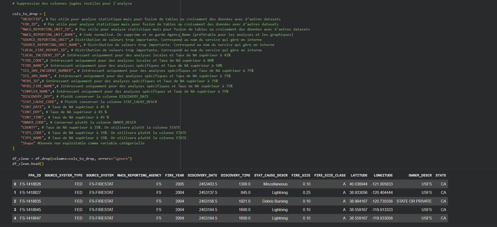

# 🔥 Analyse des Feux de Forêt aux États-Unis (1992–2015)

Projet Data complet utilisant **Python (Google Colab)** et **Power BI** pour analyser les feux de forêt aux USA entre 1992 et 2015.

---

## 📊 1. Analyse & Visualisations (Google Colab)

### Prétraitement des données
*Avant l’analyse, j’ai évalué la qualité du dataset.  
Le calcul des doublons par colonne montre que certaines variables contiennent plus de 1,8 million de valeurs répétées, ce qui indique :

- des colonnes peu informatives  
- des identifiants redondants  
- des champs administratifs inutiles pour l’analyse  

Cela m’a permis de sélectionner uniquement les colonnes pertinentes pour la suite du projet. *  

### Visualisation des tendances
*(exemple : histogrammes, heatmaps, évolution temporelle)*  

---

## 📈 2. Dashboard Power BI

### Vue générale du dashboard

### KPIs & insights

---

## 🎯 Objectifs du projet

- Identifier les zones les plus touchées  
- Analyser les causes principales  
- Étudier l’évolution temporelle  
- Construire un dashboard interactif  

---

## 📂 Ressources

- 📘 Notebook Colab : *à ajouter*  
- 📊 Dashboard Power BI : *à ajouter*  

---

## 👨‍💻 Auteur

Antonio — Data Analyst  
