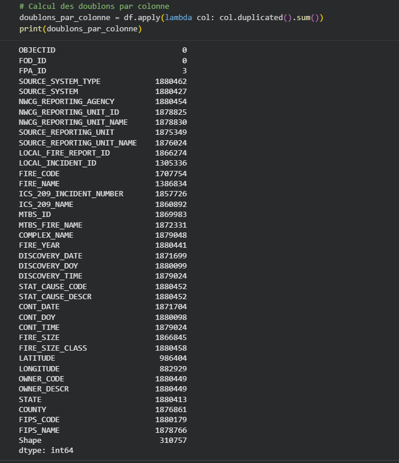
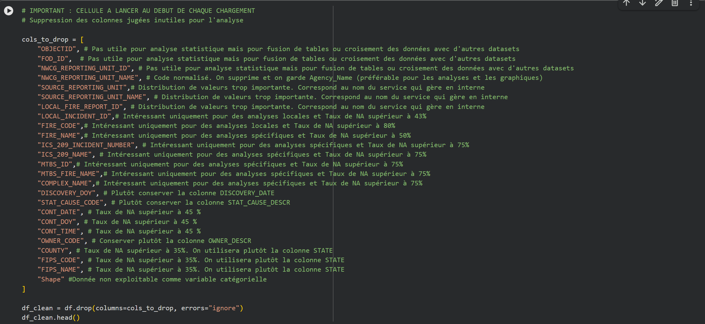
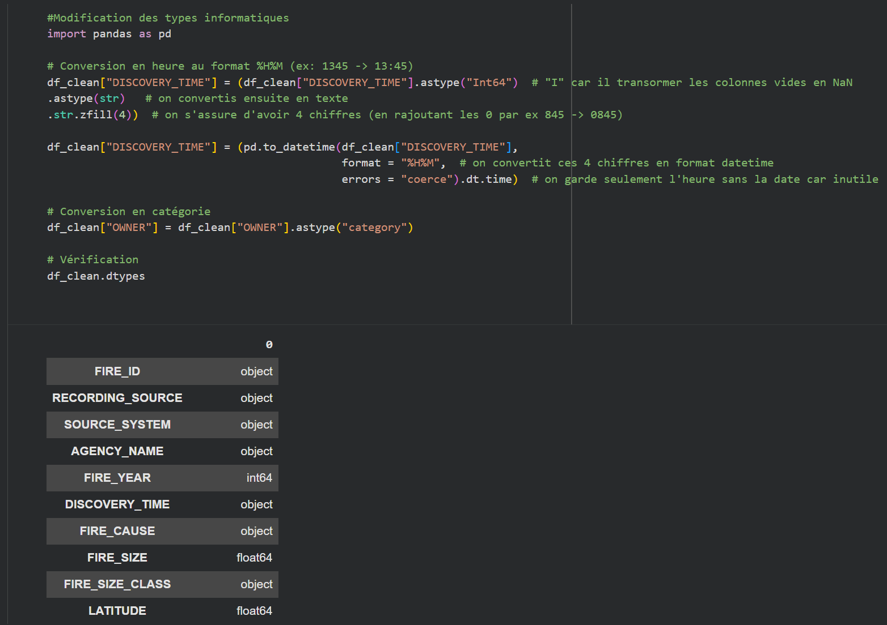
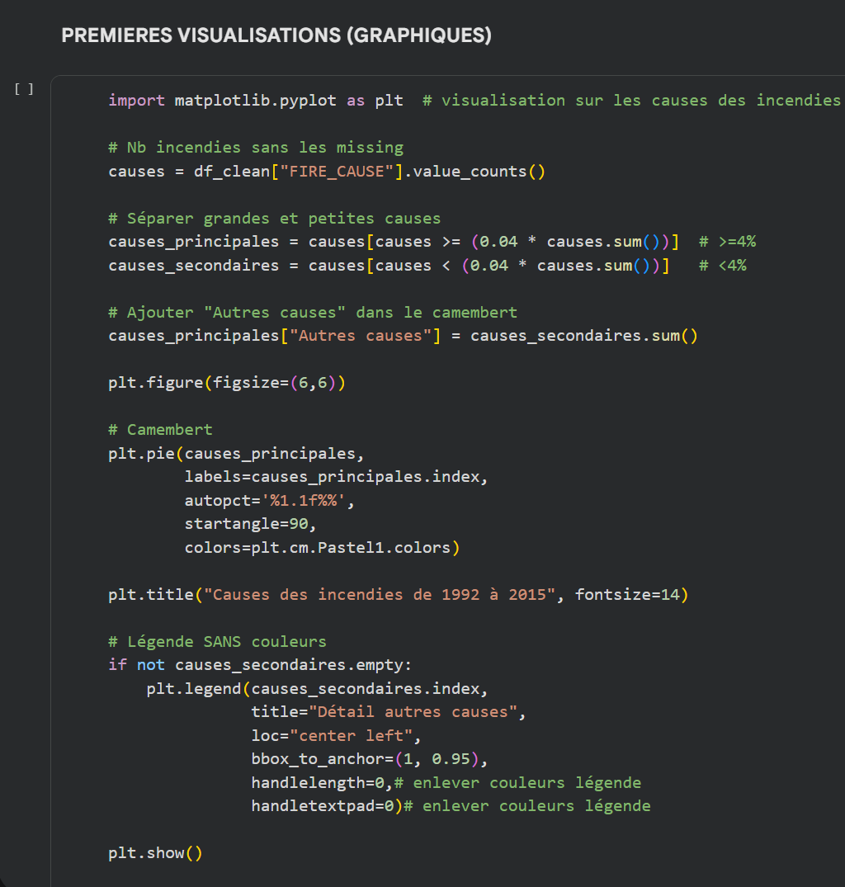
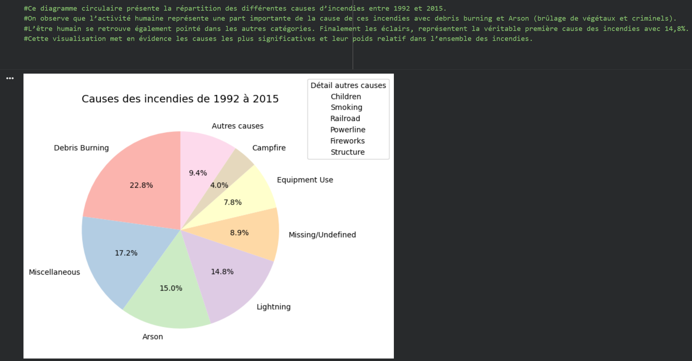
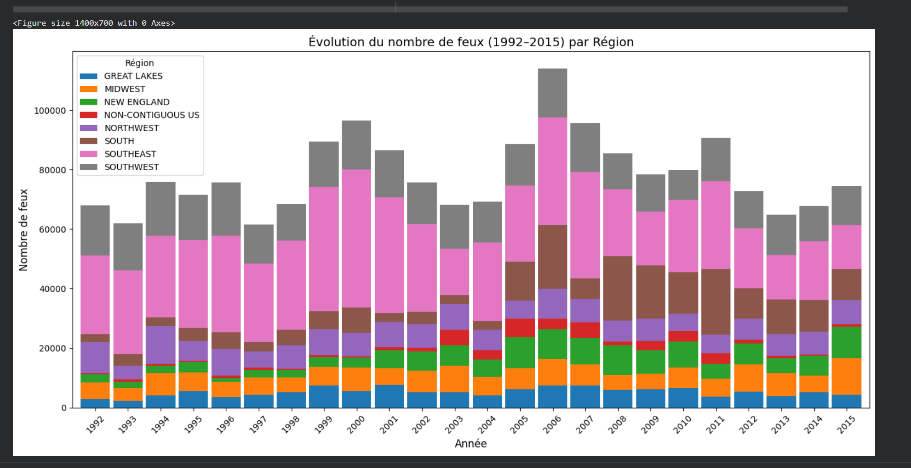
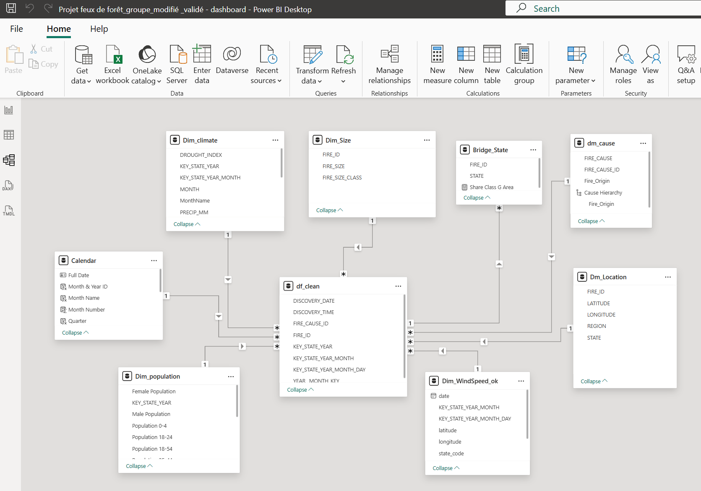

# 🔥 Analyse des Feux de Forêt aux États-Unis (1992–2015)

Projet Data complet utilisant **Python (Google Colab)** et **Power BI** pour analyser les feux de forêt aux USA entre 1992 et 2015.
---

## 🎯 Objectifs du projet

- Identifier les zones les plus touchées  
- Analyser les causes principales  
- Étudier l’évolution temporelle  
- Construire un dashboard interactif
- Apporter des préconisations afin de faire de la prévention dans les zones le plus touchées

## 📊 1. Analyse & Visualisations (Google Colab)

### Prétraitement des données

🔧Avant l’analyse, j’ai évalué la qualité du dataset.  
Le calcul des doublons par colonne montre que certaines variables contiennent plus de 1,8 million de valeurs répétées, ce qui indique :

- des colonnes peu informatives  
- des identifiants redondants  
- des champs administratifs inutiles pour l’analyse  

Cela m’a permis de sélectionner uniquement les colonnes pertinentes pour la suite du projet.

🔧Amélioration de la qualité du dataset en supprimant les colonnes qui n'apportent pas de valeurs mais et au contraire de la confusion. Cet étape permet d'harmoniser et de facilité le travail pour le chargement du dataset dans PowerBI en réduisant le nombre d'ID.

🔧Nettoyage et standardisation des types de données.

Conversion de DISCOVERY_TIME (ex: 1345 → 13:45) :
- conversion en string
- remplissage des zéros (zfill)
- transformation en format horaire avec pd.to_datetime
- extraction de .dt.time

### Visualisation des tendances

Après avoir apporter toutes les modifications, nettoyé les données, cela a permis d'effectuer des premiers essais de graphiques avec les bibliothèques de graphiques Matplotlib et Seaborn.
Dans ce cas précis le diagramme circulaire nous donne un bref apérçu des causes provoquant des feux de forêt.

 

 

---

## 📈 2. Dashboard Power BI

### Vue du schéma en étoile

Le modèle en étoile avec la table de faits (df_clean) et les tables de dimensions qui ont été créées permettent d'exploiter les données concernant les populations, les données métérologiques ainsi que les lieux principalement concernés etc...
Ce modèle a été choisi pour optimiser la performance des requêtes et également faciliter l'analyse.

### Vue générale du dashboard

### KPIs & insights

---

## 📂 Ressources

- 📘 Notebook Colab : *à ajouter*  
- 📊 Dashboard Power BI : *à ajouter*  

---

## 👨‍💻 Auteur

Antonio — Data Analyst  
